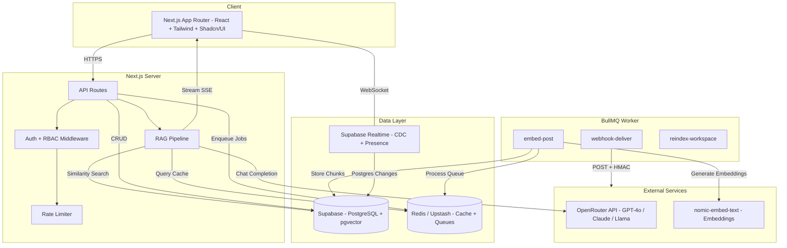

<div align="center">

# Nexus

**Real-time collaborative workspace with AI-powered semantic search**

[](https://github.com/Singhharsh75/Nexus/actions/workflows/ci.yml)
[](https://www.typescriptlang.org/)
[](LICENSE)
[](https://nodejs.org/)
[](https://nextjs.org/)

</div>

---

Nexus is a multi-user workspace where team posts are automatically embedded and indexed in pgvector, enabling natural-language queries that return **streamed, citation-backed answers** grounded in your workspace content. Built with real-time collaboration via Supabase Realtime, three-tier RBAC, and production-grade observability.

## Features

**Collaboration**
- Multi-workspace support with invite-based membership
- Three-tier RBAC (admin / member / viewer) enforced at database level via RLS
- Real-time post feed powered by Supabase Realtime (Postgres Changes + Broadcast)
- Live presence indicators showing active workspace members

**AI-Powered Search**
- Posts auto-chunked and embedded via background BullMQ worker
- pgvector similarity search with HNSW indexing (cosine, 768 dimensions)
- RAG pipeline: embed query, retrieve context, stream LLM answer with citations via SSE
- Semantic cache in Redis (normalized query hash, 1h TTL) — cache hits at ~80ms

**Platform**
- Custom JWT refresh token rotation with replay attack detection
- Webhook system with HMAC-SHA256 signatures and exponential retry (3x)
- Rate limiting: sliding window, 20 AI queries per user per hour
- Structured JSON logging (Pino) with correlation IDs + Sentry error tracking
- Health check endpoint with DB, Redis, and worker status
- Swagger API documentation at `/api/docs`

## Architecture



## Tech Stack

| Layer | Technology |
|-------|-----------|
| **Frontend** | Next.js 16 (App Router), TypeScript (strict), Tailwind CSS, Shadcn/UI |
| **Backend** | Next.js API Routes, standalone BullMQ worker process |
| **Database** | Supabase (PostgreSQL 15 + pgvector), Row-Level Security |
| **Real-Time** | Supabase Realtime (Postgres Changes + Broadcast + Presence) |
| **Queue** | BullMQ + Redis (Upstash in production) |
| **Cache** | Redis — semantic query cache, sliding-window rate limiting |
| **AI / LLM** | OpenRouter API (GPT-4o, Claude, Llama), nomic-embed-text embeddings |
| **Auth** | Supabase Auth, custom JWT rotation, three-tier RBAC |
| **Testing** | Vitest (65 integration tests), Playwright (24 E2E tests), k6 (load) |
| **Observability** | Pino (structured JSON), Sentry, `/api/health` endpoint |
| **CI/CD** | GitHub Actions (4 parallel jobs), Vercel + Supabase Cloud + Upstash |

## Quick Start

### Prerequisites

- [Node.js](https://nodejs.org/) >= 20
- [pnpm](https://pnpm.io/) >= 9
- [Docker](https://www.docker.com/) (for Redis)
- [Supabase CLI](https://supabase.com/docs/guides/cli)

### Setup

```bash
# Clone the repo
git clone https://github.com/Singhharsh75/Nexus.git
cd Nexus

# Install dependencies
pnpm install

# Configure environment
cp .env.local.example .env.local
# Fill in: Supabase URL/keys, Redis URL, OpenRouter API key, JWT secret

# Start infrastructure
docker compose up -d          # Redis
supabase start                # Local Supabase + apply migrations

# Run the app
pnpm dev                      # Next.js on http://localhost:3000
pnpm worker:dev               # BullMQ worker (separate terminal)
```

## Project Structure

```
nexus/
  src/
    app/
      (auth)/              # Login, signup, callback pages
      (dashboard)/         # Protected workspace views
      api/
        auth/              # Login, logout, refresh, callback
        workspaces/        # CRUD, members, posts, query, webhooks
        health/            # Service health check
        docs/              # Swagger UI
    components/            # React components (Shadcn/UI based)
    hooks/                 # useRealtimePosts, usePresence
    lib/
      ai/                  # RAG pipeline, embeddings, chunker, semantic cache
      auth/                # JWT, RBAC, rate limiting, refresh tokens
      supabase/            # Client, server, admin Supabase clients
      logger/              # Pino structured logging
      queue/               # BullMQ queue setup
      webhooks/            # Webhook dispatch + HMAC signing
  worker/                  # Standalone BullMQ worker process
    jobs/                  # embed-post, reindex-workspace, webhook-deliver
  supabase/migrations/     # SQL migrations (schema, RLS, pgvector)
  tests/
    integration/           # Vitest + Supertest API tests
    e2e/                   # Playwright browser tests
    load/                  # k6 load test scripts
```

## API Documentation

Interactive Swagger UI is available at `/api/docs` when the server is running.

Key endpoint groups:

| Endpoint | Description |
|----------|-------------|
| `POST /api/auth/login\|logout\|refresh` | Authentication + JWT rotation |
| `GET\|POST /api/workspaces` | Workspace CRUD + member management |
| `POST /api/workspaces/:id/query` | AI semantic search (SSE stream) |
| `GET\|POST /api/workspaces/:id/webhooks` | Webhook registration |
| `GET /api/health` | Service health (DB, Redis, worker) |

## Testing

```bash
pnpm test          # 65 integration tests (Vitest + Supertest)
pnpm test:e2e      # 24 E2E tests (Playwright)
pnpm lint          # ESLint
pnpm typecheck     # TypeScript strict check
```

### Load Test Results (k6)

| Scenario | Throughput | p50 | p95 | Notes |
|----------|-----------|-----|-----|-------|
| CRUD API | 200 req/s sustained | 15ms | 52ms | <1% error rate |
| AI Query | 50 concurrent VUs | 1,200ms | 3,800ms | LLM-bound; cache hits ~80ms |
| WebSocket | 100 connections | 120ms connect | 450ms connect | Presence updates <200ms |

Full results in [`docs/load-testing.md`](docs/load-testing.md).

## Contributing

Contributions are welcome! See [CONTRIBUTING.md](CONTRIBUTING.md) for development guidelines, coding standards, and the PR process.

## License

This project is licensed under the MIT License. See [LICENSE](LICENSE) for details.
